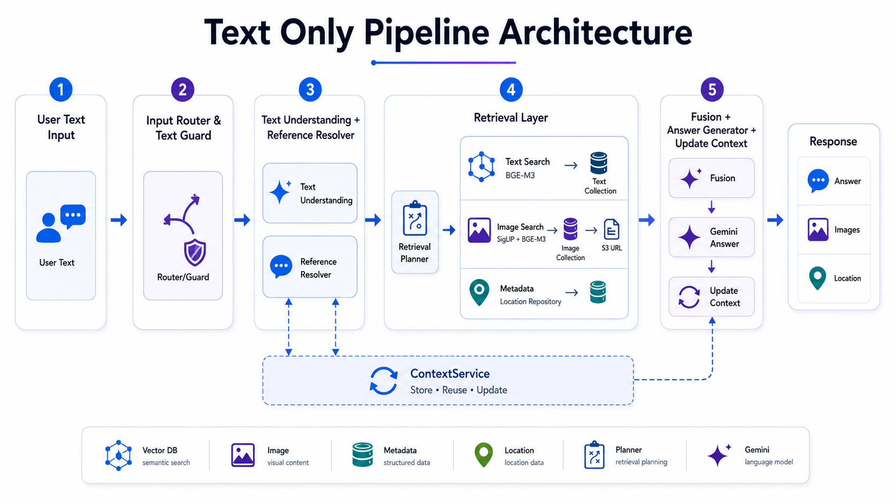
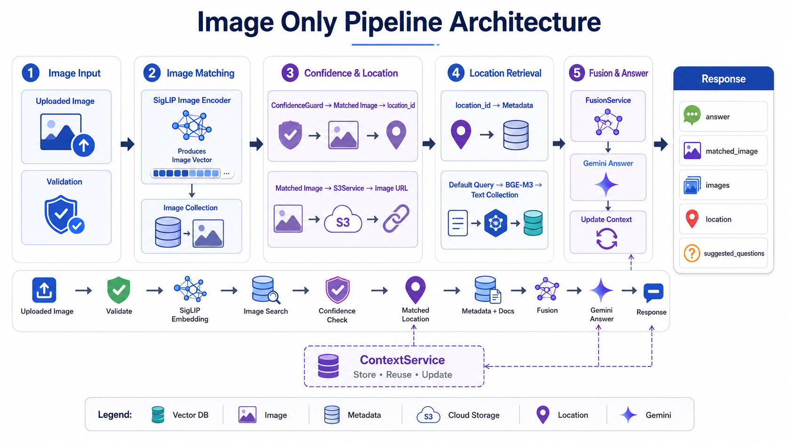
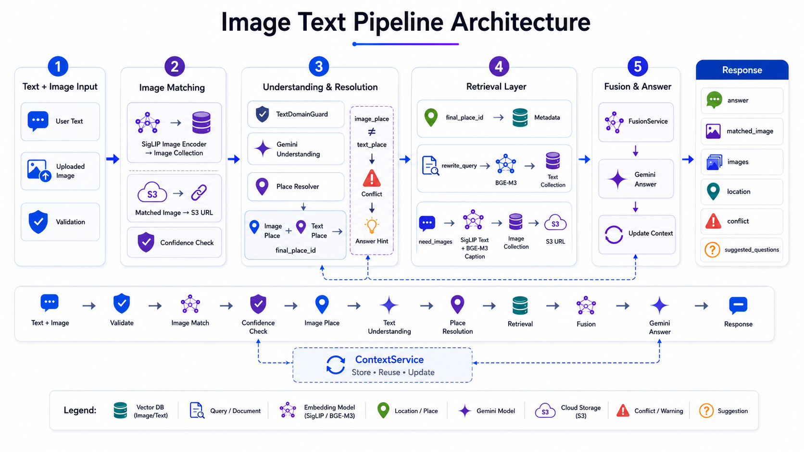
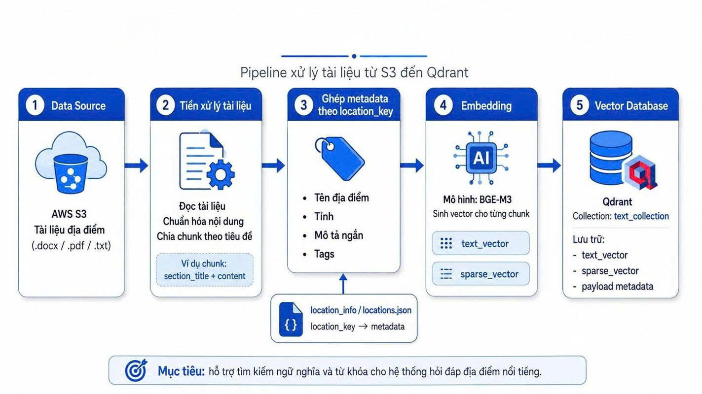
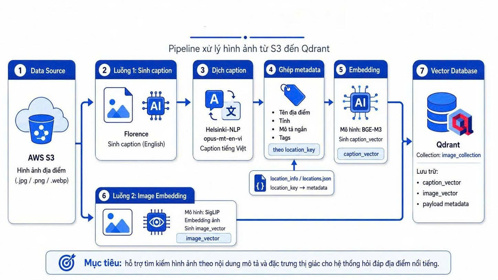
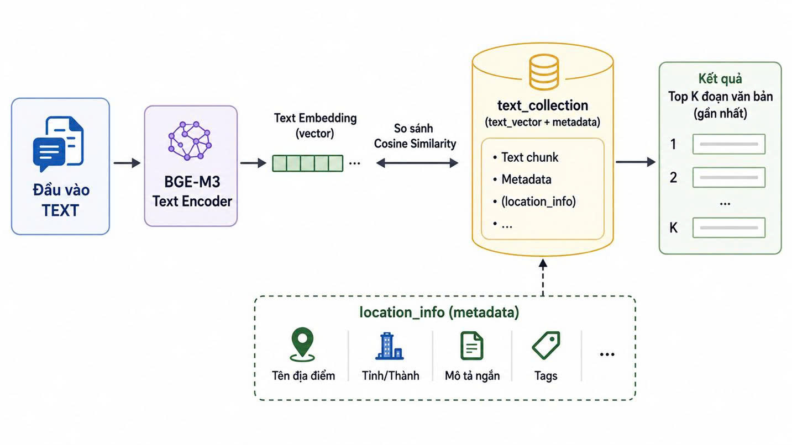
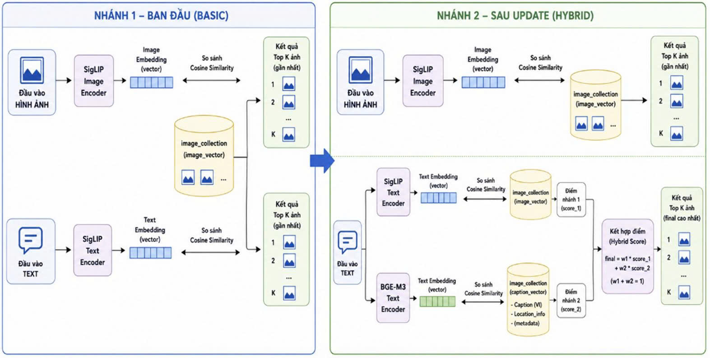

# Travel AI Assistant (Multimodal RAG)

Hệ thống trợ lý du lịch AI thông minh hỗ trợ hỏi đáp đa phương thức (**Văn bản + Hình ảnh**) về các địa điểm du lịch tại Việt Nam (Quy Nhơn, Kỳ Co, Eo Gió, Hòn Khô, Cù Lao Xanh...).

Hệ thống ứng dụng mô hình **Multimodal RAG** (Retrieval-Augmented Generation) kết hợp Vector Database (**Qdrant**), Local Embedding Models (**BGE-M3**, **SigLIP**) và LLM (**Google Gemini** với multi-key rotation) để mang lại khả năng tìm kiếm chính xác, nhận diện địa danh từ ảnh và trả lời tự nhiên, hạn chế ảo giác (hallucination).

---

## 🏛️ Kiến trúc tổng thể hệ thống (Architecture Overview)

```text
Travel-AI/
├── apps/
│   ├── web/                    # [Frontend] ReactTS + Vite (Chat UI, Gallery, Responsive)
│   ├── api/                    # [Backend] Node.js Express (REST API, MVC + Service + Repository + Pipeline)
│   └── data-pipeline/          # [Data Ingestion] Python Pipeline (S3 -> SigLIP/BGE-M3 Embedding -> Qdrant)
│
├── docs/                       # Tài liệu thiết kế, sơ đồ kiến trúc & hướng dẫn
│   ├── architecture/           # JSON Schema spec của 3 luồng xử lý
│   ├── design/                 # Tài liệu phân tích thiết kế chi tiết (Luồng hoạt động, Báo cáo đề tài)
│   ├── guides/                 # Lộ trình triển khai từng Phase & kiến trúc Frontend
│   └── images/                 # Sơ đồ kiến trúc & luồng xử lý
│
├── .gitignore
└── README.md
```

---

## 🔄 3 Luồng Xử Lý Chính (Multimodal Pipelines)

Hệ thống cung cấp endpoint duy nhất `POST /api/chat` tiếp nhận `multipart/form-data` và tự động phân loại bằng `InputRouterService` vào 3 pipeline chuyên biệt:

### 1. Luồng 1: Text-Only Pipeline (`input_type: "text_only"`)
Xử lý các câu hỏi văn bản thuần túy, nhận diện ngữ cảnh follow-up ("ở đó có gì chơi?"), tra cứu tài liệu và tìm ảnh bằng **Hybrid Search (SigLIP Visual + BGE-M3 Caption)** khi người dùng yêu cầu xem ảnh.



---

### 2. Luồng 2: Image-Only Pipeline (`input_type: "image_only"`)
Xử lý khi người dùng upload ảnh chụp một địa điểm mà không nhập câu hỏi. Hệ thống encode ảnh qua **SigLIP Image Encoder**, đối soát `image_vector` trong Qdrant, áp dụng **Confidence Guard** để xác định độ tin cậy và tự động tạo câu hỏi tổng quan truy xuất thông tin địa danh.



---

### 3. Luồng 3: Image-Text Pipeline (`input_type: "image_text"`)
Xử lý khi người dùng gửi đồng thời cả ảnh và câu hỏi. Hệ thống vừa nhận diện địa danh từ ảnh vừa phân tích ý định trong văn bản, giải quyết xung đột (**Conflict Resolution**) khi ảnh và văn bản nhắc đến hai địa điểm khác nhau.



---

## 📊 Pipeline Nạp Dữ Liệu & Hybrid Search (Data Pipeline)

### 1. Pipeline Embedding Văn Bản & Hình Ảnh
Dữ liệu văn bản (`.docx`) và hình ảnh được chuẩn hóa, vector hóa và lưu trữ đồng bộ vào Qdrant Vector Database:
- **Tài liệu văn bản**: Tạo vector 1024 chiều bằng **BGE-M3** (`text_vector` trong `text_collection`).
- **Hình ảnh**: Lưu trữ đồng thời 2 named vectors trong `image_collection`:
  - `image_vector` (768 chiều): SigLIP Image Encoder (dùng cho visual search).
  - `caption_vector` (1024 chiều): BGE-M3 Text Encoder (dùng cho semantic caption search).

| Pipeline Embedding Text | Pipeline Embedding Image |
| :---: | :---: |
|  |  |

### 2. Cơ chế Truy Xuất Tài Liệu & Hybrid Image Search
- **Truy xuất tài liệu (Docs Retrieval)**: Tìm kiếm semantic chunks kết hợp filter theo `location_id`.
- **Tìm kiếm ảnh đa nhánh (Hybrid Image Search)**: Gộp điểm giữa SigLIP text-to-image và BGE-M3 caption embedding theo công thức:
  ```text
  final_score = (siglip_score * 0.5) + (caption_score * 0.5)
  ```

| Kiến trúc Tìm Kiếm Tài Liệu | Kiến trúc Hybrid Image Search |
| :---: | :---: |
|  |  |

---

## 🗄️ Thiết Kế Qdrant Vector Database

Hệ thống sử dụng 3 collection chuẩn trong Qdrant:
1. **`location_info`**: Lưu metadata thông tin địa điểm (`location_id`, `location_key`, `location_name`, `province`, `tags`...).
2. **`text_collection`**: Lưu trữ các chunks bài viết/tài liệu du lịch (`text_vector`: 1024-dim BGE-M3).
3. **`image_collection`**: Lưu trữ ảnh với 2 named vectors:
   - `image_vector` (768-dim SigLIP)
   - `caption_vector` (1024-dim BGE-M3)

---

## 🛠️ Hướng Dẫn Cài Đặt & Khởi Chạy Local

### 1. Khởi động Qdrant Vector DB & Data Pipeline (Python)
```bash
cd apps/data-pipeline

# Khởi động Qdrant Vector DB bằng Docker
docker compose up -d

# Cài đặt môi trường Python
pip install -r requirements.txt

# Nạp dữ liệu vào Qdrant
python main.py --task full
```

### 2. Khởi động Backend API (Node.js + Express)
```bash
cd apps/api

# Cài đặt dependencies
npm install

# Tạo file cấu hình môi trường
cp .env.example .env

# Chạy server ở chế độ development (Port: 8000)
npm run dev
```
> *Kiểm tra trạng thái server*: `GET http://localhost:8000/api/health` hoặc `GET http://localhost:8000/api/health/qdrant`

### 3. Khởi động Frontend Web (React + Vite)
```bash
cd apps/web

# Cài đặt dependencies
npm install

# Tạo file cấu hình môi trường
cp .env.example .env

# Chạy dev server (Port: 5173)
npm run dev
```

---

## 📚 Tài Liệu Tham Khảo (Documentation)

- [Kế hoạch triển khai code theo từng Phase (`docs/guides/TODO_CODING_PHASES.md`)](docs/guides/TODO_CODING_PHASES.md)
- [Mô tả chi tiết luồng hoạt động Backend (`docs/design/mo_ta_luong_hoat_dong_text_image_system.md`)](docs/design/mo_ta_luong_hoat_dong_text_image_system.md)
- [Báo cáo thiết kế & kiến trúc hệ thống (`docs/design/aitravel_nhom4.md`)](docs/design/aitravel_nhom4.md)
- [Kiến trúc Frontend ReactTS (`docs/guides/FRONTEND_ARCHITECTURE.md`)](docs/guides/FRONTEND_ARCHITECTURE.md)
